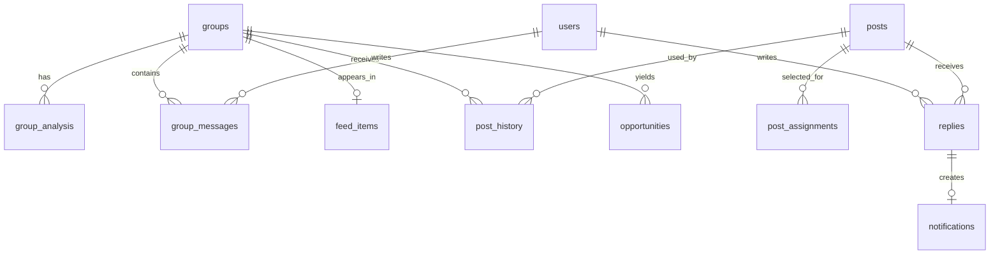

# Database Schema

PostgreSQL is the production database. UUID primary keys are used for application entities. `created_at` columns are indexed where feeds, history, notifications, and opportunities are queried chronologically.

## Tables

- `groups`: provider id, name, username, description, category, member count, joined flag.
- `group_analysis`: structured activities, member types, suitability decisions, risks, provider/model and timestamps.
- `group_messages`: mock/provider message id, group/user, content and timestamp.
- `users`: provider id, username and display name.
- `posts`: title, type, content, enabled flag, usage counters and timestamps.
- `feed_items`: ordered group membership, enabled flag, selected post, last posted time and count.
- `post_assignments`: explicit user-selected post per feed item.
- `post_history`: success/skipped/failed attempts, reason, mock message id and timestamp.
- `replies`: simulated replies with read state.
- `notifications`: reply-linked unread/read records.
- `scheduler_settings`: auto mode, work window, weekdays, interval, minimum messages, daily maximum, timezone.
- `bot_state`: singleton state and persistent feed cursor.
- `opportunities`: evidence-backed investment or partnership candidates and confidence.
- `ai_settings`: selected provider and model metadata; API secrets remain environment variables.

Required indexes cover `group_id`, `post_id`, `created_at`, `feed_items.position`, and notification read status.
